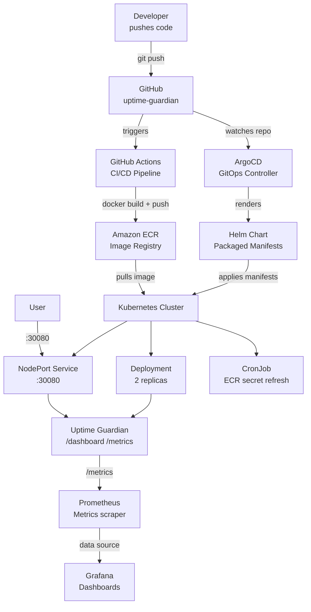

# uptime-guardian

> Know when your infrastructure fails — before your users do.

Uptime Guardian is a production-grade HTTP health-check service that monitors 
endpoint availability and response latency across any infrastructure. Built to 
demonstrate real-world DevOps practices used by engineering teams at scale — 
not a demo project, but a deployable tool solving a real problem.

Companies like Pingdom, UptimeRobot and Better Uptime charge $20–$500/month 
for this. Uptime Guardian is the open-source, self-hosted alternative you own 
and control completely.

---

## What problem does it solve?

Services go down. APIs become unresponsive. Databases stop accepting connections. 
Without active monitoring, the first person to know is usually a customer — not 
your engineering team.

Uptime Guardian gives you:
- **Instant visibility** into whether any endpoint is reachable
- **Response latency** so you catch degradation before it becomes an outage
- **A live dashboard** your team can check without touching a terminal
- **Kubernetes-native health probes** so your cluster self-heals automatically

---

## Key features

- Real-time operations dashboard with auto-refresh every 3 seconds
- Endpoint health checker — paste any URL, get status and latency instantly
- System metrics — memory pressure, CPU count, uptime, platform info
- Kubernetes liveness and readiness probes built in
- Zero-downtime rolling deployments via Kubernetes
- Self-healing — crashed pods restart automatically without human intervention
- Full CI/CD pipeline — push code, image builds and deploys with zero manual steps
- ECR lifecycle policy — automatic cleanup keeps storage costs under control

---

## Architecture

The system is built around a GitOps philosophy — Git is the single source of truth for what runs in production. No manual deployments, no configuration drift.


### CI vs CD — what's the difference?

**CI (Continuous Integration)** runs on every push and every pull request. 
It installs dependencies, runs tests, and verifies the app starts cleanly. 
If anything fails here, the image never gets built. This is the quality gate.

**CD (Continuous Delivery)** runs only when code lands on main. It builds 
the Docker image, tags it with the commit SHA for full traceability, and 
pushes it to ECR. From there, Kubernetes pulls the new image and performs 
a rolling update with zero downtime.

### Where GitOps fits

GitOps means the cluster's desired state lives in Git — not in someone's 
head or a runbook. The `k8s/` folder in this repo defines exactly what 
should be running. Any drift between Git and the cluster is detected and 
corrected automatically. No manual `kubectl apply` in production.

---

## API endpoints

| Endpoint | Method | Description |
|----------|--------|-------------|
| `/` | GET | Service info, version, system stats |
| `/healthz` | GET | Kubernetes liveness probe |
| `/readyz` | GET | Kubernetes readiness probe |
| `/api/check` | POST | Check any endpoint's health and latency |
| `/dashboard` | GET | Live operations dashboard |

**Example — check an endpoint:**
```bash
curl -X POST http://localhost:30080/api/check \
  -H "Content-Type: application/json" \
  -d '{"url": "https://api.github.com"}'
```
```json
{
  "url": "https://api.github.com",
  "status": 200,
  "latency_ms": 134,
  "healthy": true,
  "checked_at": "2026-03-20T15:47:31.000Z"
}
```

---

## Stack

| Tool | Purpose |
|------|---------|
| Node.js + Express | Application runtime |
| Docker | Containerisation — solves "works on my machine" |
| GitHub Actions | CI/CD pipeline automation |
| Amazon ECR | Private container image registry |
| Kubernetes | Container orchestration and self-healing |
| ArgoCD | GitOps continuous deployment *(in progress)* |
| Prometheus + Grafana | Metrics and alerting *(in progress)* |

---

## Local development
```bash
# Install dependencies
npm install

# Run locally
node src/server.js

# Visit dashboard
open http://localhost:3000/dashboard
```

---

## Docker
```bash
# Build image
docker build -t uptime-guardian .

# Run container
docker run -p 3000:3000 uptime-guardian

# Visit dashboard
open http://localhost:3000/dashboard
```

---

## Kubernetes
```bash
# Deploy to cluster
kubectl apply -f k8s/deployment.yaml
kubectl apply -f k8s/service.yaml

# Check status
kubectl get pods
kubectl get services

# Visit dashboard
open http://localhost:30080/dashboard

# Watch self-healing in action
kubectl delete pod <pod-name>
kubectl get pods --watch
```

---

## Project structure
```
uptime-guardian/
├── src/
│   └── server.js                    # Express app + dashboard
├── k8s/
│   ├── deployment.yaml              # Kubernetes deployment
│   └── service.yaml                 # Kubernetes service
├── aws/
│   └── ecr-lifecycle-policy.json    # ECR image cleanup rules
├── .github/
│   └── workflows/
│       └── ci.yml                   # GitHub Actions pipeline
└── Dockerfile                       # Container build instructions
```

---

## Planned improvements

- [ ] ArgoCD GitOps — automatic deployment on every merge to main
- [ ] Prometheus metrics endpoint — expose app metrics for scraping
- [ ] Grafana dashboard — visualise historical uptime and latency
- [ ] Alert manager — notify on endpoint failures
- [ ] Full architecture diagram

---

*Built by [Jnr-Neba](https://github.com/Jnr-Neba) · Open to contributions*
